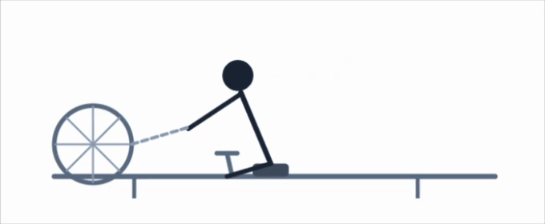

# animejs



`animejs` provides R bindings to [Anime.js v4](https://animejs.com), a
JavaScript animation library. It produces self-contained HTML widgets
via [htmlwidgets](https://www.htmlwidgets.org) that render in browser
environments like RStudio Viewer, R Markdown documents, Quarto reports,
and Shiny applications.

The package is the low-level foundation for
[`gganime`](https://github.com/long39ng/gganime), which implements a
ggplot2 animation layer with gganimate API compatibility. `animejs` has
no dependency on ggplot2 and is independently useful for animating any
hand-authored or programmatically generated SVG.

## Installation

You can install the development version of animejs from
[GitHub](https://github.com/) with:

``` r
# install.packages("pak")
pak::pak("long39ng/animejs")
```

## Usage

Annotate SVG elements with a `data-animejs-id` attribute or a CSS class,
then build a timeline in R and render it as a widget.

``` r
library(animejs)

svg_src <- '
<svg viewBox="0 0 400 200" xmlns="http://www.w3.org/2000/svg">
  <circle data-animejs-id="c1" cx="50"  cy="100" r="20" fill="#4e79a7"/>
  <circle data-animejs-id="c2" cx="120" cy="100" r="20" fill="#f28e2b"/>
  <circle data-animejs-id="c3" cx="190" cy="100" r="20" fill="#e15759"/>
</svg>
'

anime_timeline(
  duration = 800,
  ease = anime_easing_elastic(),
  loop = TRUE
) |>
  anime_add(
    selector = anime_target_css("circle"),
    props = list(
      translateY = anime_from_to(-80, 0),
      opacity = anime_from_to(0, 1)
    ),
    stagger = anime_stagger(150, from = "first")
  ) |>
  anime_add(
    selector = anime_target_id("c2"),
    props = list(r = anime_from_to(20, 40)),
    offset = "+=200"
  ) |>
  anime_render(svg = svg_src)
```


Three circles animating into view with a staggered elastic entrance,
followed by the middle circle expanding.

## Key concepts

**Timeline.**
[`anime_timeline()`](https://long39ng.github.io/animejs/reference/anime_timeline.md)
initialises a timeline with default `duration`, `ease`, and `delay`.
[`anime_add()`](https://long39ng.github.io/animejs/reference/anime_add.md)
appends animation segments to it. Both are pipe-friendly and return the
modified timeline visibly.

**Properties.**
[`anime_from_to()`](https://long39ng.github.io/animejs/reference/anime_from_to.md)
describes a two-value transition;
[`anime_keyframes()`](https://long39ng.github.io/animejs/reference/anime_keyframes.md)
describes a multi-step sequence. Both are passed inside the `props` list
of
[`anime_add()`](https://long39ng.github.io/animejs/reference/anime_add.md).

**Stagger.**
[`anime_stagger()`](https://long39ng.github.io/animejs/reference/anime_stagger.md)
distributes animation start times across the elements matched by a
selector. Supports linear, centre-out, and 2-D grid distributions.

**Easing.** All easing constructors return `anime_easing` objects
serialised to Anime.js v4 strings. Parameterised families –
[`anime_easing_elastic()`](https://long39ng.github.io/animejs/reference/anime_easing.md),
[`anime_easing_spring()`](https://long39ng.github.io/animejs/reference/anime_easing.md),
[`anime_easing_bezier()`](https://long39ng.github.io/animejs/reference/anime_easing.md),
[`anime_easing_steps()`](https://long39ng.github.io/animejs/reference/anime_easing.md),
[`anime_easing_back()`](https://long39ng.github.io/animejs/reference/anime_easing.md)
– are also available.

**Playback.**
[`anime_playback()`](https://long39ng.github.io/animejs/reference/anime_playback.md)
controls looping, direction, and an optional play/pause/scrub control
bar injected into the widget.
